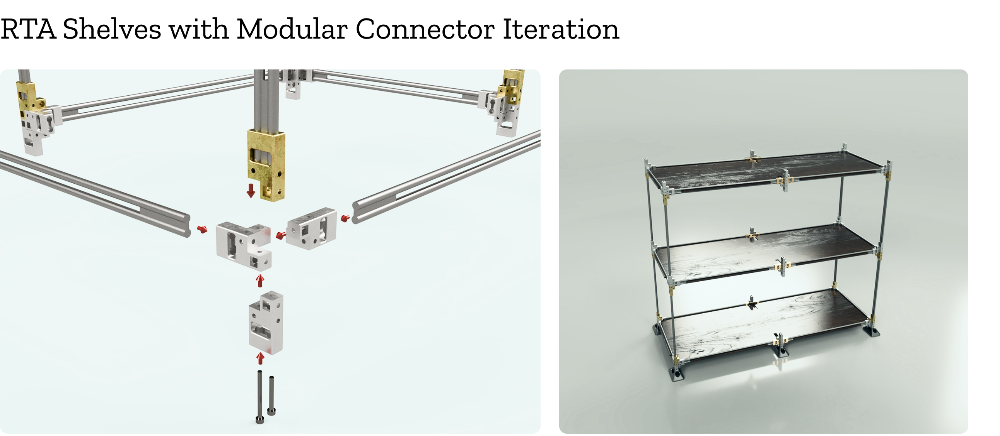

# Adaptable Living — Cursor Build Instructions (v2)

## Key Principle
**Export whole Figma pages as images** — don't disassemble diagrams. The narrative follows Sean's actual project progression, not an invented timeline.

---

## Quick Start
1. Copy `adaptable-living.html` to repo root (same level as `host-project.html`)
2. Create `images/adaptable/` folder
3. Export Figma pages as listed below → replace placeholders
4. Update `index.html` to link to the new page

---

## Figma Page Exports (Full-page screenshots)

Each placeholder in the HTML contains the exact Figma node ID. Export as **2x PNG, full page frame**:

| HTML Placeholder Label | Figma Node | Filename |
|---|---|---|
| THE MOVING Predicament | `10-1142` | `page_predicament.png` |
| Frequent Renter's Storage Pattern | `10-1455` | `storage-priority-matrix.png` |
| Richard's Needs & Behaviors | `10-1211` | `page_richard_needs.png` |
| Moving Pain Points | `28-67` | `page_pain_points.png` |
| Collected Items Data | `10-859` | `page_collected_data.png` |
| Competitor Analysis: RTA Shelf | `10-1067` | `page_competitor.png` |
| Downside of RTA Shelves | `32-175` | `page_downside_rta.png` |
| Iteration 2: RTA + Modular Connector | `10-1013` | `page_iteration2_rta.png` |
| **Design Progression Map** | `10-1604` | `page_progression_map.png` |
| Shelves That Move With You | `10-1025` | `page_shelves_move.png` |
| Practicality Meets Portability | `10-1045` | `page_practicality.png` |
| Material Preference | `10-1035` | `page_material.png` |

### How to export from Figma:
1. Open the Figma file `Final_Presentation` (key: `BZNUKdgecCV0WEpz68tqBP`)
2. Select each node by ID (use the search or navigator)
3. Right-click → Export → 2x PNG
4. Save to `images/adaptable/` with the filename above

### How to replace in HTML:
Search for `<div class="placeholder"` blocks. Each contains the node ID and target filename. Replace the entire `.placeholder` div with an `` tag:

```html
<!-- BEFORE -->
<div class="placeholder" style="min-height:460px">
    Export full Figma page<br><strong>Node 10-1013</strong>...
</div>

<!-- AFTER -->

```

---

## Content Structure (Follows Sean's actual speech flow)

### 1. Hero — "Furniture that moves with you"
Synthesised from speech intro. TOC sidebar links to all sections.

### 2. The Moving Predicament
From speech: "the chaos of moving... fitting furniture into different living spaces"
Image: Figma page 10-1142

### 3. User Research & Persona
From speech: renter storage evolution phases → persona Richard.
Images: Figma page 10-1455 (matrix PNG), **10-1211** (Richard — folder `images/adaptable/page_richard_needs/`).

**Renter storage matrix (10-1455):** The page embeds `images/adaptable/storage-priority-matrix.png` next to the coded timeline (single image, full opacity — no dim/overlay animation).

**Richard’s needs (animated stack):** Put assets in **`images/adaptable/page_richard_needs/`**:
- **`page_richard_needs.png`** — full-page **underlay** (always visible under the stack) + invisible **spacer** for height.
- **`Frame1.png`** — **Workspace** (box 1) + line to the first User Insight (Hao); this is the first **fade** (fixes “missing frame 1” when the base PNG omits box 1).
- **`Frame2.png` … `Frame5.png`** — frames 2–5; **fade in order 1→5** (each after the previous finishes). Same canvas size. Tune with **`--richard-frame-dur`** in `adaptable-living.html`.
- If **`page_richard_needs.png`** already includes everything, exports may look redundant with **`Frame1.png`** — then export Frame1 as a transparent delta or remove the underlay in HTML.

Quotes integrated from speech (Ben, Sam, Hao)

### 4. Requirements & Collected Data
From speech: functional requirements list + measured item dimensions → shelf size
Image: Figma page 10-859 (full data table + item photos + 3D render)

### 5. Competitor Analysis
From speech: RTA market is saturated, ball joints win, renters prioritise effortless over reusability
Images: Figma pages 10-1067, 32-175

### 6. Prototyping & Iteration
**This is the corrected flow:**
- Started with polygon experiments (brief mention — negative user feedback)
- Then RTA with modular connectors (Figma 10-1013) — assembly too complex
- User quotes about assembly frustration (Leo, Geo)
- **Design Progression Map** (Figma 10-1604) — shows the full evolution in one diagram
- Insights from this phase pushed toward foldable solution

### 7. The Solution — Shelves That Move With You
From speech: Richard's use case — stacking, enclosed/open display, converting to moving bins
Images: Figma pages 10-1025, 10-1045, 10-1035

### 8. Next Stage
From speech: sheet metal fabrication, manufacturer sourcing, luxury RV market

---

## Styling Match with host_project

The CSS uses the same design system as `host-project.html`:
- **Font:** EB Garamond (display) + Inter (body) — EB Garamond is web-safe stand-in for Cooper Lt BT
- **Accent:** `#087A91` (teal)
- **Alternating sections:** white ↔ `#EEFCFF`
- **Sidebar TOC:** 240px left column with active-state highlighting
- **Grid decoration:** 48px grid pattern at 3.5% opacity on left edge
- **Section spacing:** 80–160px (responsive clamp)
- **Content offset:** 460px from left on desktop, centered on mobile
- **Back button:** Fixed top-left, glass-morphism style

### To use Cooper Lt BT (if available locally):
```css
--ff-display: 'Cooper Lt BT', 'EB Garamond', Georgia, serif;
```
And add a `@font-face` declaration for the font file.
